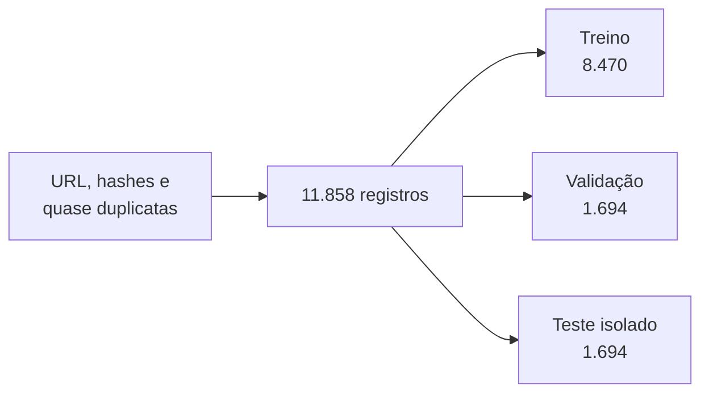

# Metodologia experimental

## Unidade textual

A entrada dos modelos é composta pelos campos disponíveis:

```text
TITULO: <título>
SUBTITULO: <subtítulo, quando disponível>
TEXTO: <conteúdo>
```

A limpeza aplica Unicode NFKC, normalização de espaços e remoção de caracteres
de controle. Acentos, pontuação, caixa e stopwords são preservados. Não foi
aplicado novo stemming ou lematização, pois essas operações podem apagar
negação, modalidade e entidades relevantes.

## Divisão dos dados



O `StratifiedGroupKFold` mantém as classes balanceadas sem permitir que o mesmo
grupo apareça em mais de uma parte.

| Split | Fake | Real | Total |
|---|---:|---:|---:|
| Treino | 4.235 | 4.235 | 8.470 |
| Validação | 847 | 847 | 1.694 |
| Teste | 847 | 847 | 1.694 |

## Seleção dos modelos

1. Os hiperparâmetros são ajustados somente no treino.
2. Cinco folds agrupados avaliam cada configuração.
3. Macro-F1 é o critério de seleção.
4. A validação é usada para escolher a composição do stacking.
5. Treino e validação são unidos para o ajuste final.
6. O teste isolado é usado apenas na avaliação final.

Cada TF-IDF é ajustado dentro do respectivo fold. Ajustar o vocabulário antes da
validação permitiria que frequências do holdout influenciassem o treinamento.

## Métricas

- Accuracy, Precision, Recall, F1 e Macro-F1;
- ROC-AUC e PR-AUC;
- matriz de confusão e classification report;
- Brier Score e Log Loss;
- curvas ROC, Precision-Recall e calibração;
- tempo de ajuste e inferência;
- sobreposição dos erros entre modelos.

## Avaliação temporal

Como diagnóstico adicional, registros até **2021-02-19** treinam os modelos e
registros posteriores formam o teste temporal. Grupos que atravessam o corte são
mantidos integralmente no futuro.

| Modelo | Macro-F1 temporal |
|---|---:|
| Logistic Regression | 0,9674 |
| Linear SVM calibrado | **0,9815** |
| Multinomial Naive Bayes | 0,9374 |
