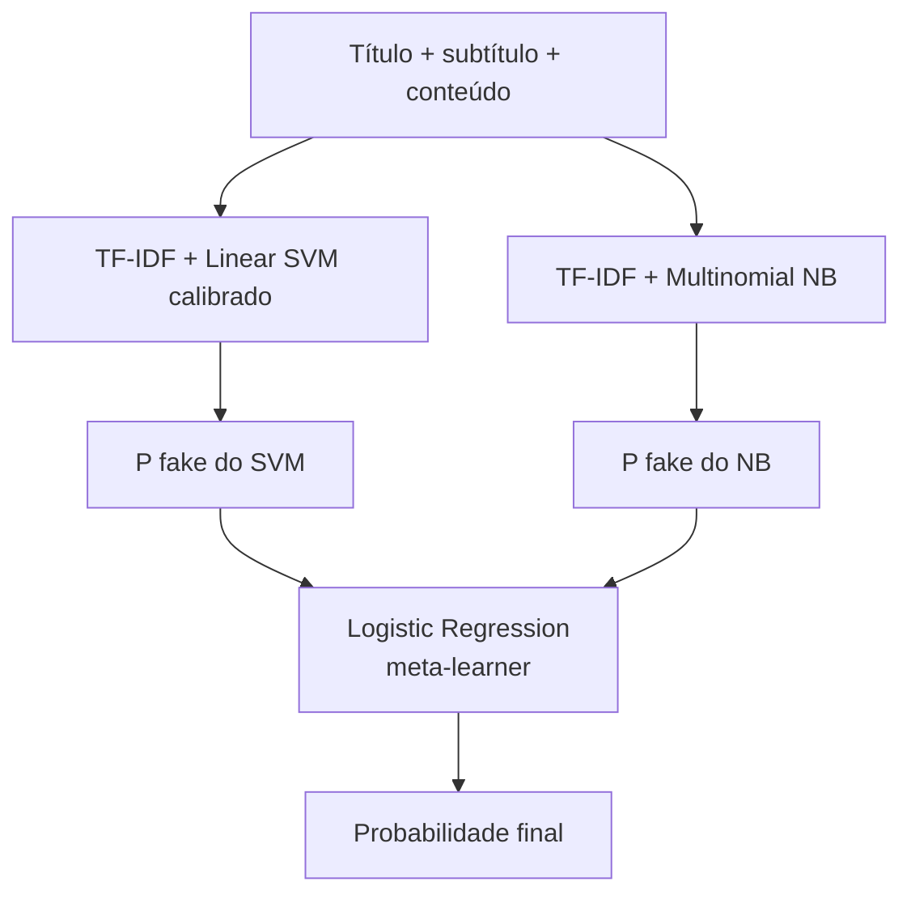

# E04 — Stacking com previsões OOF

## Arquitetura

## Por que OOF?

O meta-modelo não pode ser treinado com previsões feitas sobre os mesmos
registros usados para ajustar os modelos-base. Isso produziria features
otimistas e vazamento do alvo.

Em cada um dos cinco folds:

1. quatro partes ajustam cada base learner;
2. a quinta parte recebe previsões;
3. as probabilidades são armazenadas;
4. o processo se repete até cada notícia possuir uma previsão OOF.

Os relatórios confirmam sobreposição de grupos igual a zero em todos os folds.

## Ablações

| Modelos-base | Macro-F1 na validação | Log Loss |
|---|---:|---:|
| SVM + Naive Bayes | **0,9882** | **0,0445** |
| Logistic + SVM | 0,9876 | 0,0448 |
| Logistic + SVM + NB | 0,9876 | 0,0448 |
| Logistic + NB | 0,9764 | 0,0641 |

A Logistic Regression do nível 1 aprendeu coeficientes de **8,60 para o SVM** e
**1,33 para o NB**. Isso mostra forte dependência do SVM e uma correção menor do
Naive Bayes; coeficientes correlacionados não devem ser lidos como importância
causal.

## Resultado final

| Métrica | Valor |
|---|---:|
| Macro-F1 | 0,9852 |
| ROC-AUC | 0,9979 |
| Brier Score | 0,0112 |
| Custo de ajuste | 82,28 s |

O stacking é válido e carregável, mas não foi selecionado: cometeu 25 erros,
contra 21 do SVM, e custou aproximadamente 4,2 vezes mais no processo completo.
