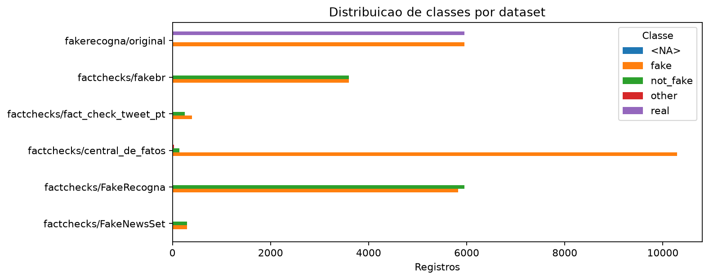

# Relatorio de EDA — Noticias brasileiras

> Gerado de forma reprodutivel por `python -m src.analysis.pipeline`. Os dados brutos nao foram alterados. As tabelas completas estao em `reports/tables/`.

## Executive Summary

Foram perfilados 6 datasets/subconjuntos, totalizando 42,591 registros contados separadamente. Esse total **nao representa noticias unicas**, pois ha aliases e sobreposicoes entre fontes. O FakeRecogna independente possui 11,903 linhas, enquanto a versao incorporada ao FactChecks.br tem outra selecao e outro schema.

**Evidencia → interpretacao → impacto:** foram encontradas 11,877 assinaturas exatas compartilhadas entre datasets (132 com semantica de label conflitante apos equiparar `not_fake` a `real`) e 234 pares candidatos a quase duplicata dentro dos datasets (3 conflitos). Isso confirma que linha nao deve ser usada como unidade de sorteio; grupos de noticia/URL precisam permanecer no mesmo fold.

Os principais riscos classificados como altos foram: Associacao label-domain em factchecks/FakeNewsSet; Associacao label-domain em factchecks/central_de_fatos; Associacao label-category em factchecks/central_de_fatos; Separacao temporal entre classes em factchecks/central_de_fatos. A severidade segue um criterio operacional: **alta** quando um atalho pode afetar grande parte da base ou transferir a mesma noticia entre treino e teste; **media** quando a evidencia e localizada ou depende da estrategia de split; **baixa** quando o sinal existe, mas tem cobertura pequena. Severidade mede risco metodologico, nao qualidade moral da fonte.

## Datasets analisados

| dataset                        |   records |   columns | raw_labels   | period_start   | period_end   | main_columns                                                                                     |
|:-------------------------------|----------:|----------:|:-------------|:---------------|:-------------|:-------------------------------------------------------------------------------------------------|
| factchecks/FakeNewsSet         |       598 |        15 | -1, 1        |                |              | dataset, review_id, review_url, review_domain, claim_ids, is_fake, raw_label, label_semantic     |
| factchecks/FakeRecogna         |     11773 |        18 | -1, 1        | 2018-08-29     | 2021-12-07   | dataset, review_id, review_text, review_author, review_url, review_domain, review_date, category |
| factchecks/central_de_fatos    |     10461 |        18 | -1, 0, 1     | 2013-01-07     | 2021-12-05   | dataset, review_id, review_text, review_author, review_url, review_domain, review_date, category |
| factchecks/fact_check_tweet_pt |       656 |        15 | -1, 1        |                |              | dataset, review_id, review_url, review_domain, claim_ids, is_fake, raw_label, label_semantic     |
| factchecks/fakebr              |      7200 |        16 | -1, 1        | 2009-06-01     | 2018-07-23   | dataset, claim_text, claim_author, claim_url, claim_date, category, is_fake, raw_label           |
| fakerecogna/original           |     11903 |        20 | 0.0, 1.0     | 2012-02-09     | 2021-12-07   | dataset, Titulo, Subtitulo, Noticia, Categoria, Data, Autor, URL                                 |

O FactChecks.br inclui tarefas diferentes: `fakebr` contem texto de alegacoes/noticias; `FakeRecogna` e `central_de_fatos` contem textos de revisao/fonte; `fact_check_tweet_pt` e `FakeNewsSet` contêm pares/IDs e URLs, sem texto integral no release. Portanto, nem todos servem diretamente para a mesma tarefa de classificacao textual.

## Qualidade dos dados

- **Evidencia:** factchecks/fact_check_tweet_pt tem 100.0% de ausencia em `date_raw`. **Interpretacao:** o campo nao esta uniformemente disponivel. **Impacto:** comparacoes e splits que dependam dele precisam excluir ou sinalizar esses casos.
- **Evidencia:** factchecks/FakeNewsSet tem 100.0% de ausencia em `date_raw`. **Interpretacao:** o campo nao esta uniformemente disponivel. **Impacto:** comparacoes e splits que dependam dele precisam excluir ou sinalizar esses casos.
- **Evidencia:** factchecks/FakeNewsSet tem 100.0% de ausencia em `text`. **Interpretacao:** o campo nao esta uniformemente disponivel. **Impacto:** comparacoes e splits que dependam dele precisam excluir ou sinalizar esses casos.
- **Evidencia:** factchecks/fact_check_tweet_pt tem 100.0% de ausencia em `text`. **Interpretacao:** o campo nao esta uniformemente disponivel. **Impacto:** comparacoes e splits que dependam dele precisam excluir ou sinalizar esses casos.
- **Evidencia:** factchecks/FakeRecogna tem 3.1% de ausencia em `date_raw`. **Interpretacao:** o campo nao esta uniformemente disponivel. **Impacto:** comparacoes e splits que dependam dele precisam excluir ou sinalizar esses casos.

A linha sem label do FakeRecogna original e mantida na camada intermediaria, nao imputada. Datas que nao puderam ser interpretadas permanecem `NaT`, enquanto `date_raw` preserva o valor recebido.

## Distribuicao das classes

- **factchecks/FakeNewsSet / label bruto `-1`:** 298 registros (49.8%), interpretado como `not_fake` conforme a documentacao da fonte.
- **factchecks/FakeNewsSet / label bruto `1`:** 300 registros (50.2%), interpretado como `fake` conforme a documentacao da fonte.
- **factchecks/FakeRecogna / label bruto `-1`:** 5951 registros (50.5%), interpretado como `not_fake` conforme a documentacao da fonte.
- **factchecks/FakeRecogna / label bruto `1`:** 5822 registros (49.5%), interpretado como `fake` conforme a documentacao da fonte.
- **factchecks/central_de_fatos / label bruto `-1`:** 141 registros (1.3%), interpretado como `not_fake` conforme a documentacao da fonte.
- **factchecks/central_de_fatos / label bruto `0`:** 34 registros (0.3%), interpretado como `other` conforme a documentacao da fonte.
- **factchecks/central_de_fatos / label bruto `1`:** 10286 registros (98.3%), interpretado como `fake` conforme a documentacao da fonte.
- **factchecks/fact_check_tweet_pt / label bruto `-1`:** 256 registros (39.0%), interpretado como `not_fake` conforme a documentacao da fonte.
- **factchecks/fact_check_tweet_pt / label bruto `1`:** 400 registros (61.0%), interpretado como `fake` conforme a documentacao da fonte.
- **factchecks/fakebr / label bruto `-1`:** 3600 registros (50.0%), interpretado como `not_fake` conforme a documentacao da fonte.
- **factchecks/fakebr / label bruto `1`:** 3600 registros (50.0%), interpretado como `fake` conforme a documentacao da fonte.
- **fakerecogna/original / label bruto `0.0`:** 5951 registros (50.0%), interpretado como `fake` conforme a documentacao da fonte.
- **fakerecogna/original / label bruto `1.0`:** 5951 registros (50.0%), interpretado como `real` conforme a documentacao da fonte.
- **fakerecogna/original / label bruto `<NA>`:** 1 registros (0.0%), interpretado como `<NA>` conforme a documentacao da fonte.

As definicoes nao sao unificadas automaticamente. No FactChecks.br, `1 = fake`, `-1 = not_fake` e `0 = other`; no FakeRecogna original, `0 = fake` e `1 = real`. Alem disso, `central_de_fatos` e predominantemente uma colecao de checagens classificadas como falsas, enquanto outros corpora sao balanceados por construcao.

## Caracteristicas textuais

| dataset                     | label_semantic   |   n_characters_median |   n_characters_q25 |   n_characters_q75 |   n_words_median |   n_words_q25 |   n_words_q75 |   n_sentences_median |   n_sentences_q25 |   n_sentences_q75 |   title_length_median |   title_length_q25 |   title_length_q75 |   n_exclamations_median |   n_exclamations_q25 |   n_exclamations_q75 |   n_questions_median |   n_questions_q25 |   n_questions_q75 |   n_urls_median |   n_urls_q25 |   n_urls_q75 |   n_numbers_median |   n_numbers_q25 |   n_numbers_q75 |   uppercase_percent_median |   uppercase_percent_q25 |   uppercase_percent_q75 |
|:----------------------------|:-----------------|----------------------:|-------------------:|-------------------:|-----------------:|--------------:|--------------:|---------------------:|------------------:|------------------:|----------------------:|-------------------:|-------------------:|------------------------:|---------------------:|---------------------:|---------------------:|------------------:|------------------:|----------------:|-------------:|-------------:|-------------------:|----------------:|----------------:|---------------------------:|------------------------:|------------------------:|
| factchecks/FakeRecogna      | fake             |                   618 |             410    |             873.75 |             96   |         64.25 |           135 |                  1   |              1    |              2    |                     0 |                  0 |                  0 |                       0 |                    0 |                    0 |                    0 |                 0 |                 0 |               0 |            0 |            0 |                  1 |            0    |               2 |                   1.48368  |                0.700638 |                 2.26013 |
| factchecks/FakeRecogna      | not_fake         |                   738 |             584.5  |             916    |            110   |         87    |           136 |                  1   |              1    |              1    |                     0 |                  0 |                  0 |                       0 |                    0 |                    0 |                    0 |                 0 |                 0 |               0 |            0 |            0 |                  1 |            0    |               3 |                   0.581395 |                0.322754 |                 1.01523 |
| factchecks/central_de_fatos | fake             |                  3450 |            2629    |            4494    |            587   |        444    |           760 |                 24   |             18    |             31    |                     0 |                  0 |                  0 |                       0 |                    0 |                    2 |                    1 |                 0 |                 2 |               0 |            0 |            0 |                 10 |            6    |              18 |                   4.02668  |                3.26598  |                 5.02757 |
| factchecks/central_de_fatos | not_fake         |                  3376 |            2163    |            5617    |            554   |        360    |           917 |                 24   |             13    |             39    |                     0 |                  0 |                  0 |                       0 |                    0 |                    0 |                    0 |                 0 |                 1 |               0 |            0 |            0 |                 15 |            8    |              30 |                   4.18692  |                3.67902  |                 5.03876 |
| factchecks/central_de_fatos | other            |                  1820 |            1068.25 |            2460.5  |            294.5 |        181.25 |           412 |                 12.5 |              8.25 |             18.75 |                     0 |                  0 |                  0 |                       0 |                    0 |                    0 |                    0 |                 0 |                 1 |               0 |            0 |            0 |                  9 |            3.25 |              14 |                   4.30827  |                3.44406  |                 5.06427 |
| factchecks/fakebr           | fake             |                   952 |             691.75 |            1348    |            157   |        115    |           223 |                  9   |              7    |             12    |                     0 |                  0 |                  0 |                       0 |                    0 |                    1 |                    0 |                 0 |                 1 |               0 |            0 |            0 |                  2 |            0    |               4 |                   4.43732  |                3.48666  |                 5.5969  |
| factchecks/fakebr           | not_fake         |                  5580 |            3871.25 |            8585.75 |            922   |        645.75 |          1424 |                 42   |             28    |             66    |                     0 |                  0 |                  0 |                       0 |                    0 |                    0 |                    0 |                 0 |                 1 |               0 |            0 |            0 |                 13 |            7    |              22 |                   3.9408   |                3.15323  |                 4.77555 |
| fakerecogna/original        | fake             |                   409 |             227    |             577    |             60   |         34    |            84 |                  1   |              1    |              1    |                    79 |                 69 |                 91 |                       0 |                    0 |                    0 |                    0 |                 0 |                 0 |               0 |            0 |            0 |                  0 |            0    |               1 |                   0        |                0        |                 0       |
| fakerecogna/original        | real             |                   626 |             492    |             794    |             91   |         72    |           116 |                  1   |              1    |              1    |                    73 |                 68 |                 77 |                       0 |                    0 |                    0 |                    0 |                 0 |                 0 |               0 |            0 |            0 |                  1 |            0    |               2 |                   0        |                0        |                 0       |

As medianas e intervalos interquartis devem ser lidos por dataset: diferencas grandes entre classes podem refletir o processo de coleta (por exemplo, texto de checagem versus noticia publicada), nao uma propriedade universal da desinformacao. Os graficos por dataset em `reports/figures/` testam especificamente comprimento e pontuacao. Stopwords, caixa, stemming e lematizacao nao foram removidos nesta etapa, para que potenciais artefatos permaneçam visiveis.

## Analise de fontes

- **Evidencia:** 7188 registros de factchecks/fakebr pertencem a valores frequentes de `domain` observados em uma unica classe. **Interpretacao:** o metadado funciona como proxy do label. **Impacto:** o modelo pode identificar origem/coleta em vez da veracidade do conteudo.
- **Evidencia:** 6989 registros de factchecks/central_de_fatos pertencem a valores frequentes de `category` observados em uma unica classe. **Interpretacao:** o metadado funciona como proxy do label. **Impacto:** o modelo pode identificar origem/coleta em vez da veracidade do conteudo.
- **Evidencia:** 6061 registros de factchecks/central_de_fatos pertencem a valores frequentes de `domain` observados em uma unica classe. **Interpretacao:** o metadado funciona como proxy do label. **Impacto:** o modelo pode identificar origem/coleta em vez da veracidade do conteudo.
- **Evidencia:** 5969 registros de fakerecogna/original pertencem a valores frequentes de `author` observados em uma unica classe. **Interpretacao:** o metadado funciona como proxy do label. **Impacto:** o modelo pode identificar origem/coleta em vez da veracidade do conteudo.
- **Evidencia:** 5817 registros de factchecks/FakeRecogna pertencem a valores frequentes de `author` observados em uma unica classe. **Interpretacao:** o metadado funciona como proxy do label. **Impacto:** o modelo pode identificar origem/coleta em vez da veracidade do conteudo.
- **Evidencia:** 5589 registros de fakerecogna/original pertencem a valores frequentes de `domain` observados em uma unica classe. **Interpretacao:** o metadado funciona como proxy do label. **Impacto:** o modelo pode identificar origem/coleta em vez da veracidade do conteudo.
- **Evidencia:** 4335 registros de factchecks/FakeRecogna pertencem a valores frequentes de `domain` observados em uma unica classe. **Interpretacao:** o metadado funciona como proxy do label. **Impacto:** o modelo pode identificar origem/coleta em vez da veracidade do conteudo.
- **Evidencia:** 1928 registros de factchecks/fakebr pertencem a valores frequentes de `author` observados em uma unica classe. **Interpretacao:** o metadado funciona como proxy do label. **Impacto:** o modelo pode identificar origem/coleta em vez da veracidade do conteudo.

Os graficos `*_domains.png` mostram a composicao das classes nos dominios mais frequentes. Uma fonte exclusivamente associada a uma classe e um forte atalho de coleta; esse campo nao deve entrar inadvertidamente no texto de treinamento.

## Duplicatas

- **Evidencia:** factchecks/FakeNewsSet possui 0 linhas envolvidas em duplicacao de `text` (0 grupos). **Interpretacao:** linhas nao sao unidades independentes. **Impacto:** um split aleatorio pode inflar as metricas.
- **Evidencia:** factchecks/FakeNewsSet possui 10 linhas envolvidas em duplicacao de `url` (4 grupos). **Interpretacao:** linhas nao sao unidades independentes. **Impacto:** um split aleatorio pode inflar as metricas.
- **Evidencia:** factchecks/FakeRecogna possui 0 linhas envolvidas em duplicacao de `text` (0 grupos). **Interpretacao:** linhas nao sao unidades independentes. **Impacto:** um split aleatorio pode inflar as metricas.
- **Evidencia:** factchecks/FakeRecogna possui 350 linhas envolvidas em duplicacao de `url` (124 grupos). **Interpretacao:** linhas nao sao unidades independentes. **Impacto:** um split aleatorio pode inflar as metricas.
- **Evidencia:** factchecks/central_de_fatos possui 0 linhas envolvidas em duplicacao de `text` (0 grupos). **Interpretacao:** linhas nao sao unidades independentes. **Impacto:** um split aleatorio pode inflar as metricas.
- **Evidencia:** factchecks/central_de_fatos possui 0 linhas envolvidas em duplicacao de `url` (0 grupos). **Interpretacao:** linhas nao sao unidades independentes. **Impacto:** um split aleatorio pode inflar as metricas.
- **Evidencia:** factchecks/fact_check_tweet_pt possui 0 linhas envolvidas em duplicacao de `text` (0 grupos). **Interpretacao:** linhas nao sao unidades independentes. **Impacto:** um split aleatorio pode inflar as metricas.
- **Evidencia:** factchecks/fact_check_tweet_pt possui 218 linhas envolvidas em duplicacao de `url` (80 grupos). **Interpretacao:** linhas nao sao unidades independentes. **Impacto:** um split aleatorio pode inflar as metricas.
- **Evidencia:** factchecks/fakebr possui 4 linhas envolvidas em duplicacao de `text` (2 grupos). **Interpretacao:** linhas nao sao unidades independentes. **Impacto:** um split aleatorio pode inflar as metricas.
- **Evidencia:** factchecks/fakebr possui 34 linhas envolvidas em duplicacao de `url` (17 grupos). **Interpretacao:** linhas nao sao unidades independentes. **Impacto:** um split aleatorio pode inflar as metricas.
- **Evidencia:** fakerecogna/original possui 32 linhas envolvidas em duplicacao de `text` (16 grupos). **Interpretacao:** linhas nao sao unidades independentes. **Impacto:** um split aleatorio pode inflar as metricas.
- **Evidencia:** fakerecogna/original possui 352 linhas envolvidas em duplicacao de `url` (125 grupos). **Interpretacao:** linhas nao sao unidades independentes. **Impacto:** um split aleatorio pode inflar as metricas.

Entre datasets, ha 11,877 assinaturas de URL ou texto compartilhadas. A tabela `cross_dataset_duplicates.csv` e a lista diagnostica `near_duplicate_candidates.csv` devem alimentar um futuro `group_id`. Candidatos aproximados foram detectados com TF-IDF de n-gramas de caracteres e similaridade >= 0,96; eles exigem revisao antes de qualquer exclusao.

## Possiveis vieses

- **Vies de fonte:** noticias rotuladas como verdadeiras e falsas foram coletadas de tipos de portal distintos. O classificador pode aprender o dominio/estilo editorial.
- **Vies de categoria:** distribuicoes tematicas diferentes podem transformar assunto em proxy do label.
- **Vies temporal:** classes podem cobrir janelas distintas; mudancas de vocabulário e eventos tornam a data um atalho.
- **Vies de representacao:** os datasets representam fontes e agendas especificas, nao toda noticia brasileira nem toda nocao de confiabilidade.

## Possiveis data leakages

| Risco                                                           | Evidencia                                                                 | Severidade   | Recomendacao                                                                                 |
|:----------------------------------------------------------------|:--------------------------------------------------------------------------|:-------------|:---------------------------------------------------------------------------------------------|
| Associacao label-domain em factchecks/FakeNewsSet               | 72.4% dos registros estao em valores com >=5 casos e uma unica classe.    | alta         | Auditar e considerar group split por domain; comparar baseline com e sem o campo.            |
| Associacao label-domain em factchecks/FakeRecogna               | 36.8% dos registros estao em valores com >=5 casos e uma unica classe.    | média        | Auditar e considerar group split por domain; comparar baseline com e sem o campo.            |
| Associacao label-author em factchecks/FakeRecogna               | 49.4% dos registros estao em valores com >=5 casos e uma unica classe.    | média        | Auditar e considerar group split por author; comparar baseline com e sem o campo.            |
| Associacao label-category em factchecks/FakeRecogna             | 11.7% dos registros estao em valores com >=5 casos e uma unica classe.    | baixa        | Auditar e considerar group split por category; comparar baseline com e sem o campo.          |
| Separacao temporal entre classes em factchecks/FakeRecogna      | Inicio das classes difere em ate 399 dias; consultar tabela de periodos.  | média        | Testar split temporal e medir desempenho por janela de tempo.                                |
| Associacao label-domain em factchecks/central_de_fatos          | 57.9% dos registros estao em valores com >=5 casos e uma unica classe.    | alta         | Auditar e considerar group split por domain; comparar baseline com e sem o campo.            |
| Associacao label-category em factchecks/central_de_fatos        | 66.8% dos registros estao em valores com >=5 casos e uma unica classe.    | alta         | Auditar e considerar group split por category; comparar baseline com e sem o campo.          |
| Separacao temporal entre classes em factchecks/central_de_fatos | Inicio das classes difere em ate 766 dias; consultar tabela de periodos.  | alta         | Testar split temporal e medir desempenho por janela de tempo.                                |
| Associacao label-domain em factchecks/fact_check_tweet_pt       | 4.1% dos registros estao em valores com >=5 casos e uma unica classe.     | baixa        | Auditar e considerar group split por domain; comparar baseline com e sem o campo.            |
| Associacao label-domain em factchecks/fakebr                    | 99.8% dos registros estao em valores com >=5 casos e uma unica classe.    | alta         | Auditar e considerar group split por domain; comparar baseline com e sem o campo.            |
| Associacao label-author em factchecks/fakebr                    | 26.8% dos registros estao em valores com >=5 casos e uma unica classe.    | média        | Auditar e considerar group split por author; comparar baseline com e sem o campo.            |
| Associacao label-category em factchecks/fakebr                  | 0.0% dos registros estao em valores com >=5 casos e uma unica classe.     | baixa        | Auditar e considerar group split por category; comparar baseline com e sem o campo.          |
| Separacao temporal entre classes em factchecks/fakebr           | Inicio das classes difere em ate 1200 dias; consultar tabela de periodos. | alta         | Testar split temporal e medir desempenho por janela de tempo.                                |
| Associacao label-domain em fakerecogna/original                 | 47.0% dos registros estao em valores com >=5 casos e uma unica classe.    | média        | Auditar e considerar group split por domain; comparar baseline com e sem o campo.            |
| Associacao label-author em fakerecogna/original                 | 50.1% dos registros estao em valores com >=5 casos e uma unica classe.    | alta         | Auditar e considerar group split por author; comparar baseline com e sem o campo.            |
| Associacao label-category em fakerecogna/original               | 11.8% dos registros estao em valores com >=5 casos e uma unica classe.    | baixa        | Auditar e considerar group split por category; comparar baseline com e sem o campo.          |
| Separacao temporal entre classes em fakerecogna/original        | Inicio das classes difere em ate 2650 dias; consultar tabela de periodos. | alta         | Testar split temporal e medir desempenho por janela de tempo.                                |
| Sobreposicao entre datasets                                     | 11877 assinaturas cruzadas; 132 apresentam conflito semantico de label.   | alta         | Agrupar por URL/texto antes do split e revisar conflitos; nunca sortear linhas isoladamente. |

Nunca executar `train_test_split()` por linha antes de criar grupos de duplicidade. URLs, autores, dominios e marcadores editoriais (como `#boato`) devem ser auditados com ablations.

## Comparacao entre datasets

| dataset                        |   records |   columns | raw_labels   | period_start   | period_end   | main_columns                                                                                     |   mean_core_missing_percent |   duplicated_text_rows |
|:-------------------------------|----------:|----------:|:-------------|:---------------|:-------------|:-------------------------------------------------------------------------------------------------|----------------------------:|-----------------------:|
| factchecks/FakeNewsSet         |       598 |        15 | -1, 1        |                |              | dataset, review_id, review_url, review_domain, claim_ids, is_fake, raw_label, label_semantic     |                    50       |                      0 |
| factchecks/FakeRecogna         |     11773 |        18 | -1, 1        | 2018-08-29     | 2021-12-07   | dataset, review_id, review_text, review_author, review_url, review_domain, review_date, category |                     0.843   |                      0 |
| factchecks/central_de_fatos    |     10461 |        18 | -1, 0, 1     | 2013-01-07     | 2021-12-05   | dataset, review_id, review_text, review_author, review_url, review_domain, review_date, category |                     0.0095  |                      0 |
| factchecks/fact_check_tweet_pt |       656 |        15 | -1, 1        |                |              | dataset, review_id, review_url, review_domain, claim_ids, is_fake, raw_label, label_semantic     |                    50       |                      0 |
| factchecks/fakebr              |      7200 |        16 | -1, 1        | 2009-06-01     | 2018-07-23   | dataset, claim_text, claim_author, claim_url, claim_date, category, is_fake, raw_label           |                     0       |                      4 |
| fakerecogna/original           |     11903 |        20 | 0.0, 1.0     | 2012-02-09     | 2021-12-07   | dataset, Titulo, Subtitulo, Noticia, Categoria, Data, Autor, URL                                 |                     0.74525 |                     32 |

Tres caminhos devem permanecer em aberto:

**A. Usar separadamente.** Preserva a definicao e a tarefa de cada corpus; facilita diagnosticar desempenho intra-dominio, mas reduz diversidade e nao mede transferencia.

**B. Combinar subconjuntos compativeis.** Pode aumentar cobertura, desde que labels, unidade textual e duplicatas sejam harmonizados com regras versionadas. Nao se recomenda concatenacao direta dos cinco benchmarks.

**C. Treinar em um dataset e testar externamente em outro.** Mede generalizacao entre coletas e fontes, mas exige remover toda sobreposicao antes e interpretar divergencias de label/tarefa.

Nenhuma opcao foi escolhida automaticamente.

## Limitacoes

- Metadados ausentes nao foram inferidos da web.
- A deteccao de quase duplicatas e baseada em similaridade lexical e pode conter falsos positivos/negativos.
- `review_text` pode ser texto de checagem, enquanto `Noticia` no FakeRecogna disponibilizado ja aparenta preprocessamento linguistico; comparacoes estilisticas precisam considerar essa diferenca.
- A associacao estatistica entre fonte e label nao prova causalidade nem veracidade.
- O total agregado conta versoes sobrepostas do FakeRecogna e nao deve ser usado como tamanho de um corpus combinado.

## Recomendacoes para preparacao dos dados

1. Definir a unidade de predicao: alegacao, noticia original ou texto de checagem.
2. Criar `group_id` por URL canonica, hash de texto e cluster de quase duplicatas antes do split.
3. Revisar manualmente conflitos de label e documentar uma taxonomia; nunca mapear `other` para binario por conveniencia.
4. Comparar: split estratificado **apenas apos agrupamento**, group split por noticia/fonte, split temporal e dataset externo como holdout.
5. O split estratificado preserva proporcoes, mas nao resolve duplicatas; group split reduz vazamento por fonte/noticia; temporal split testa drift; holdout externo testa transferencia, desde que descontaminado.
6. Preservar texto original e registrar cada transformacao; avaliar normalizacao, stopwords e lematizacao somente via ablation.

## Proximos experimentos

- **Baseline 1 — TF-IDF + Logistic Regression:** rapido, interpretavel por coeficientes e capaz de produzir probabilidades que podem ser calibradas.
- **Baseline 2 — TF-IDF + Linear SVM:** baseline forte para alta dimensionalidade; margens nao devem ser tratadas como probabilidades sem calibracao.
- **Baseline 3 — Bag-of-Words + Logistic Regression:** ancora simples para medir o ganho real do TF-IDF.

Avaliar Accuracy, Precision, Recall, F1, Macro-F1, matriz de confusao, ROC-AUC e PR-AUC quando aplicaveis. **Accuracy nunca isoladamente.** Reportar resultados por fonte, periodo e dataset alem da media global.

`predict_proba()` representa a **probabilidade produzida pelo classificador sob seus dados e hipoteses**, nao a confiabilidade factual da noticia. Uma probabilidade alta pode refletir atalho, desbalanceamento ou erro de calibracao. Em etapa futura, estudar Brier Score, Log Loss, reliability diagrams, Platt Scaling e Isotonic Regression.

BERTimbau e outros Transformers devem ser avaliados apenas depois desses baselines e do protocolo de split sem leakage.
